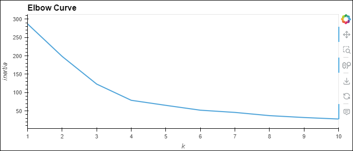
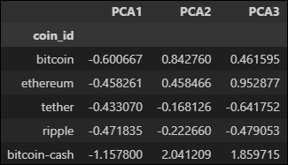
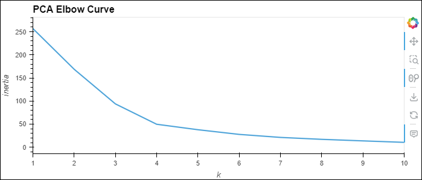
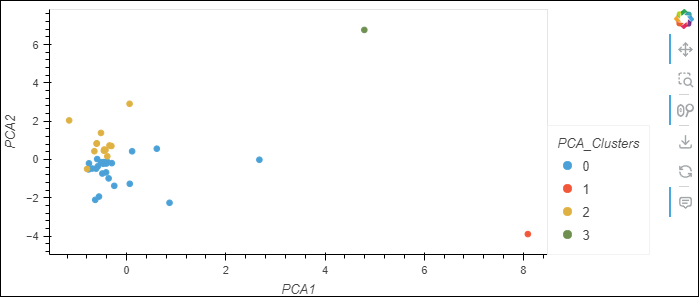

# CryptoClustering

### Scenario

In this challenge, you’ll use your knowledge of Python and unsupervised learning to predict if cryptocurrencies are affected by 24-hour or 7-day price changes.

------

### Prepare the Data

- Use the `StandardScaler()` module from `scikit-learn` to normalize the data from the CSV file.
- Create a DataFrame with the scaled data and set the "coin_id" index from the original DataFrame as the index for the new DataFrame.

| Scaled DataFrame |
| ---------------- |
|  |

------

#### Find the Best Value for k Using the Original Scaled DataFrame

Use the elbow method to find the best value for `k` using the following steps:

- Create a list with the number of `k` values from 1 to 11.
- Create an empty list to store the inertia values.
- Create a `for` loop to compute the inertia with each possible value of `k`.
- Create a dictionary with the data to plot the elbow curve.
- Plot a line chart with all the inertia values computed with the different values of `k` to visually identify the optimal value for `k`.
- Answer the following question in your notebook: What is the best value for `k`?
    - My answer: *"Looking at the `Elbow Curve` ... the inertia value appears to plateau from the `k` value of `4`. Therefore, the best value for `k` is `4`."*

| Original Data Elbow Curve |
|--------------|
|  |  

-------

#### Cluster Cryptocurrencies with K-means Using the Original Scaled Data

Use the following steps to cluster the cryptocurrencies for the best value for `k` on the original scaled data:

- Initialize the K-means model with the best value for `k`.
- Fit the K-means model using the original scaled DataFrame.
- Predict the clusters to group the cryptocurrencies using the original scaled DataFrame.
- Create a copy of the original data and add a new column with the predicted clusters.
- Create a scatter plot using hvPlot as follows:
    - Set the x-axis as "price_change_percentage_24h" and the y-axis as "price_change_percentage_7d".
    - Color the graph points with the labels found using K-means.
    - Add the "coin_id" column in the `hover_cols` parameter to identify the cryptocurrency represented by each data point.

| Original Data Scatter Plot: |
|--------------|
|  |

--------

### Optimize Clusters with Principal Component Analysis

- Using the original scaled DataFrame, perform a PCA and reduce the features to three principal components.
- Retrieve the explained variance to determine how much information can be attributed to each principal component and then answer the following question in your notebook:
    - What is the total explained variance of the three principal components?
    - My answer: *"The total explained variance for the three principal components is 0.895, or 89.5%. This shows that these three components account for the majority of the variance within the dataset."*
- Create a new DataFrame with the PCA data and set the "coin_id" index from the original DataFrame as the index for the new DataFrame.

| PCA DataFrame: |
|--------------|
|  |

--------

### Find the Best Value for k Using the PCA Data

Use the elbow method on the PCA data to find the best value for `k` using the following steps:

- Create a list with the number of k-values from 1 to 11.
- Create an empty list to store the inertia values.
- Create a `for` loop to compute the inertia with each possible value of `k`.
- Create a dictionary with the data to plot the Elbow curve.
- Plot a line chart with all the inertia values computed with the different values of `k` to visually identify the optimal value for `k`.
- Answer the following question in your notebook:
    - What is the best value for `k` when using the PCA data?
    - My answer: *"Looking at the elbow curve above, the best value for `k` using the PCA data is `4`."*
    - Does it differ from the best `k` value found using the original data?
    - My answer: *"This does not differ from the best value of `k` found using the original data."*

| PCA Data Elbow Curve: |
|--------------|
|  |

--------

### Cluster Cryptocurrencies with K-means Using the PCA Data

Use the following steps to cluster the cryptocurrencies for the best value for `k` on the PCA data:

- Initialize the K-means model with the best value for `k`.
- Fit the K-means model using the PCA data.
- Predict the clusters to group the cryptocurrencies using the PCA data.
- Create a copy of the DataFrame with the PCA data and add a new column to store the predicted clusters.
- Create a scatter plot using hvPlot as follows:
    - Set the x-axis as "PCA1" and the y-axis as "PCA2".
    - Color the graph points with the labels found using K-means.
    - Add the "coin_id" column in the `hover_cols` parameter to identify the cryptocurrency represented by each data point.

| PCA Data Scatter: |
|--------------|
|  |

--------

### Visualize and Compare the Results

In this section, you will visually analyze the cluster analysis results by contrasting the outcome with and without using the optimization techniques.

- Answer the following question:
    - What is the impact of using fewer features to cluster the data using K-Means?
    - My answer: *"Using fewer features to cluster the data causes the majority clusters to become much more concentrated compared to the original data plot. The PCA plot, with fewer features, has also distanced cluster `3` (`coin_id` = "celsius-degree-token") from clusters `0` and `2` which is in contrast to the original data plot where cluster `3` appears to be amongst cluster `0`. This clearly shows that there is a feature within the original data which is having a strong contribution to `coin_id` "celsius_degree_token" to have it's own cluster; which is not coming through on the plot. The PCA data, in my opinion, displays a much better representation of the clusters, and that `4` is in fact the correct number of clusters required for this dataset."*

| Elbow Composite: |
|--------------|
|  |

| Scatter Composite: |
|--------------|
|  |

--------

## References

| Reference Name | Description |
|----------------|-------------|
| edX Boot Camps LLC | Dataset generation and starter files |
| [scikit-learn](https://scikit-learn.org/stable/index.html) | *"Scikit-learn is an open source machine learning library that supports supervised and unsupervised learning. It also provides various tools for model fitting, data preprocessing, model selection, model evaluation, and many other utilities."* |
| [hvPlot](https://hvplot.holoviz.org/index.html) | *"A familiar and high-level API for data exploration and visualization"* |
| Anuj M. Ajwani | BootCamp instructor.  Provided the code for the first cell to combat the memory leak bug currently found in scikit-learn |